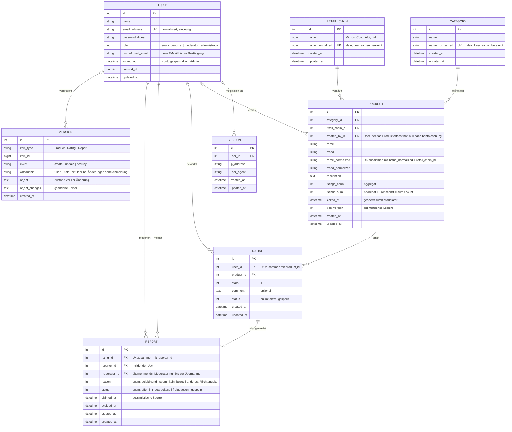
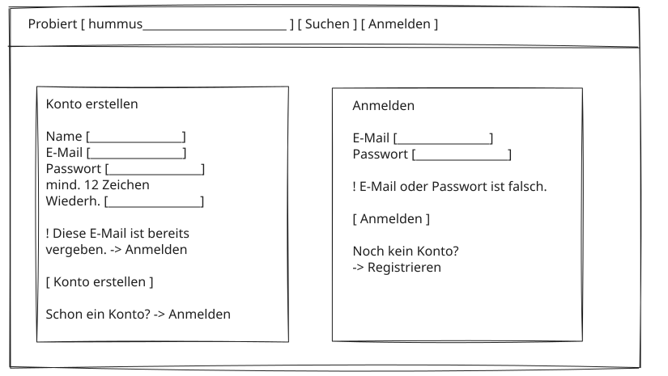

# Projektantrag: Probiert

**Modul:** 223 – Multiuser-Applikationen objektorientiert realisieren\
**Datum:** 25.09.2026\
**Autor:** Bawan Mahmud\
**Schulklasse:** Ina24b

---

## 1. Problemstellung

Beim Einkaufen im Supermarkt stehe ich regelmässig vor Regalen mit dutzenden
sehr ähnlichen Produkten: fünf Sorten Hummus, ein Dutzend Fertigsaucen, immer
wieder neue Eigenmarken-Artikel von Migros, Coop, Aldi oder Lidl.

Ob ein Produkt tatsächlich schmeckt, erfahre ich erst zu Hause. Fehlkäufe
bedeuten verschwendetes Geld und oft auch weggeworfene Lebensmittel. Um das zu
vermeiden, greife ich meistens zum immer gleichen Artikel und probiere Neues gar
nicht erst aus.

Die vorhandenen Informationsquellen helfen dabei wenig weiter: Bewertungen
existieren – wenn überhaupt – nur in den Online-Shops der einzelnen Händler,
sind also pro Kette getrennt und dort stark mit dem Verkaufsinteresse
verknüpft. Ein Vergleich über die Ketten hinweg («Welcher der vier erhältlichen
Hummus ist der beste?») ist damit nicht möglich. Im Laden selbst bleibt nur, die
Verpackung zu studieren und lange vor dem Regal zu stehen.

Betroffen bin ich bei praktisch jedem Grosseinkauf, also ein- bis zweimal pro
Woche. Im Freundes- und Familienkreis werden Empfehlungen heute mündlich oder in
Chat-Gruppen ausgetauscht – unstrukturiert, nicht auffindbar und nach wenigen
Tagen verloren.

**Bedürfnisse aus Sicht der Benutzer**

- Vor dem Kauf wissen, ob sich ein unbekanntes Produkt lohnt.
- Ähnliche Produkte verschiedener Ketten direkt miteinander vergleichen.
- Die eigene Erfahrung festhalten, um sie später wiederzufinden und anderen
  zugänglich zu machen.
- Neue Produkte entdecken, ohne im Laden lange suchen zu müssen.

## 2. Projekt

- **Domäne:** Lebensmitteleinkauf und Konsumentenerfahrung
- **Name der Applikation:** Probiert
- **Vision:** Probiert wird entwickelt, damit Konsumentinnen und Konsumenten
  ihre Erfahrungen mit Supermarktprodukten kettenübergreifend an einem Ort
  sammeln und abrufen können. Wer vor dem Regal steht oder den Einkauf plant,
  soll in wenigen Sekunden sehen, welche Produkte anderen tatsächlich geschmeckt
  haben, und dadurch weniger Fehlkäufe machen und Neues mit geringerem Risiko
  ausprobieren. Der Produktkatalog wird dabei von der Gemeinschaft selbst
  gepflegt und ist unabhängig von den Händlern.

### Abgrenzung

Nicht Teil des Projekts sind ein Online-Shop oder Bestellfunktionen,
Preisvergleiche, die Anbindung an Systeme der Händler sowie automatische
Datenimporte aus externen Produktdatenbanken. Der Katalog entsteht
ausschliesslich durch Erfassung durch die Benutzer.

## 3. Projektplanung: 1. MVP Iteration

Die wichtigste domänenspezifische funktionale Anforderung der ersten Iteration
ist **das Bewerten eines Produkts**, inklusive des dafür nötigen, von der
Gemeinschaft gepflegten Produktkatalogs.

### Fachlicher Ablauf der Kernfunktion

1. Der Benutzer sucht ein Produkt über Bezeichnung, Marke oder Handelskette.
2. Findet er es nicht, erfasst er es neu (Bezeichnung, Marke, Kategorie,
   Handelskette). Das System prüft dabei auf bereits vorhandene Einträge.
3. Auf der Produktdetailseite gibt er eine Bewertung ab: 1–5 Sterne und
   optionaler Kommentar.
4. Das System speichert die Bewertung und aktualisiert Durchschnittswert und
   Anzahl Bewertungen des Produkts.
5. Der Benutzer erhält eine Bestätigung und sieht seine Bewertung im
   aktualisierten Produktbild.

### Fachliche Regel

Pro Benutzer und Produkt existiert **höchstens eine** aktive Bewertung. Eine
zweite Bewertung desselben Produkts wird nicht angelegt; der Benutzer wird
stattdessen auf die Bearbeitung seiner bestehenden Bewertung geführt. Gesperrte
Produkte können nicht bewertet werden.

### Fehlerfall

Zwei gleichzeitige Schreibvorgänge auf dasselbe Produkt – zum Beispiel wenn zwei
Benutzer dasselbe neue Produkt zeitgleich erfassen oder derselbe Benutzer eine
Bewertung in zwei geöffneten Sitzungen abschickt – dürfen weder zu doppelten
Einträgen noch zu falschen Durchschnittswerten führen. Genau eine Aktion wird
ausgeführt, die andere wird abgelehnt und dem Benutzer verständlich erklärt,
ohne dass seine Eingaben verloren gehen.

### Umzusetzende Multi-User-Aspekte der 1. Iteration

- Registrierung, Anmeldung und Sitzungsverwaltung
- Rollen und serverseitige Berechtigungsprüfung bei jedem Zugriff
- Gleichzeitige Schreibzugriffe auf dasselbe Produkt (Bewertungen, Aggregate,
  Katalogdaten)
- Transaktionen für alle mehrteiligen Schreibvorgänge
- Konfliktbehandlung mit verständlicher Rückmeldung an den Benutzer
- Moderation gemeldeter Inhalte durch genau eine zuständige Person

## 4. Anforderungsanalyse

### 4.1 Funktionale Anforderungen (priorisiert)

Priorität 1 = zwingend für die 1. MVP Iteration.

*Tabelle 1: Funktionale Anforderungen, priorisiert*

| Nr. | Prio | Anforderung                                                                                                                               | Iteration |
| --- | ---- | ----------------------------------------------------------------------------------------------------------------------------------------- | --------- |
| F1  | 1    | Benutzer können sich registrieren, anmelden und abmelden.                                                                                 | 1         |
| F2  | 1    | Benutzer können Produkte nach Bezeichnung, Marke, Kategorie und Handelskette suchen und filtern.                                          | 1         |
| F3  | 1    | Benutzer können ein Produkt mit 1–5 Sternen und optionalem Kommentar bewerten; pro Benutzer und Produkt ist genau eine Bewertung möglich. | 1         |
| F4  | 1    | Benutzer können ihre eigene Bewertung ändern oder löschen; Durchschnitt und Anzahl werden entsprechend nachgeführt.                       | 1         |
| F5  | 1    | Die Produktdetailseite zeigt Durchschnittsbewertung, Anzahl Bewertungen, Verteilung der Sterne und die Kommentare anderer Benutzer.       | 1         |
| F6  | 1    | Benutzer können neue Produkte erfassen; das System verhindert doppelte Einträge derselben Marke/Bezeichnung/Kette.                        | 1         |
| F7  | 1    | Benutzer können unangemessene Bewertungen melden; Moderatoren übernehmen eine Meldung und geben die Bewertung frei oder sperren sie.      | 1         |
| F8  | 1    | Moderatoren können Produktdaten korrigieren und fehlerhafte Produkte sperren.                                                             | 1         |
| F9  | 2    | Eine Entdecken-Seite zeigt bestbewertete und neu erfasste Produkte je Kategorie und Handelskette.                                         | 2         |
| F10 | 2    | Benutzer können Produkte auf einer persönlichen Merkliste ablegen.                                                                        | 2         |
| F11 | 3    | Benutzer können Produktfotos hochladen.                                                                                                   | 3         |
| F12 | 3    | Administratoren können Kategorien und Handelsketten verwalten.                                                                            | 3         |

### 4.2 Qualitätsattribute (nicht-funktional, priorisiert und überprüfbar)

*Tabelle 2: Qualitätsattribute, priorisiert und überprüfbar*

| Nr. | Prio | Qualitätsattribut                | Überprüfbare Anforderung                                                                                                                                                                                                                                                           |
| --- | ---- | -------------------------------- | ---------------------------------------------------------------------------------------------------------------------------------------------------------------------------------------------------------------------------------------------------------------------------------- |
| Q1  | 1    | Datenkonsistenz                  | Werden 50 Bewertungen gleichzeitig für dasselbe Produkt gespeichert, entsprechen Anzahl und Durchschnitt danach exakt den tatsächlich gespeicherten Bewertungen. Schickt derselbe Benutzer zwei Bewertungen für dasselbe Produkt gleichzeitig ab, existiert danach genau eine.     |
| Q2  | 1    | Korrekte Autorisierung           | Für jede der drei Rollen prüfen automatisierte Tests mindestens einen erlaubten und einen verweigerten Zugriff. Kein Benutzer kann eine fremde Bewertung ändern oder löschen; Versuche werden serverseitig mit Statuscode 403 abgewiesen.                                          |
| Q3  | 1    | Verständliche Konfliktbehandlung | Bei einem Konflikt (Doppelbewertung, Duplikat beim Erfassen, konkurrierende Bearbeitung) erhält der Benutzer eine Meldung in Alltagssprache, seine Eingaben bleiben im Formular erhalten und die nächste mögliche Handlung ist verlinkt. Nachgewiesen für alle drei Fälle im Test. |
| Q4  | 2    | Performance der Suche            | Bei 5'000 erfassten Produkten und zehn gleichzeitigen Suchanfragen liefert die Produktsuche das Ergebnis in höchstens zwei Sekunden (95. Perzentil), gemessen auf dem Entwicklungsrechner.                                                                                         |
| Q5  | 2    | Testbarkeit und Wartbarkeit      | Die Testsuite deckt alle Modelle und Autorisierungsregeln der 1. Iteration ab, läuft vollständig grün und in weniger als 60 Sekunden durch.                                                                                                                                        |

### 4.3 Benutzerrollen

*Tabelle 3: Benutzerrollen und ihre Berechtigungen*

| Rolle         | Beschreibung                                                    | Berechtigungen                                                                                                                                                                                                                                                                                                                                             |
| ------------- | --------------------------------------------------------------- | ---------------------------------------------------------------------------------------------------------------------------------------------------------------------------------------------------------------------------------------------------------------------------------------------------------------------------------------------------------- |
| Benutzer      | Registrierte Person, die einkauft und ihre Erfahrungen teilt.   | Produkte suchen und ansehen, Produkte erfassen, eigene Bewertungen erstellen, ändern und löschen, fremde Bewertungen melden.                                                                                                                                                                                                                               |
| Moderator     | Pflegt die Datenqualität des Katalogs und bearbeitet Meldungen. | Alle Rechte des Benutzers, zusätzlich: Produktdaten aller Produkte korrigieren, Produkte sperren und entsperren, Meldungen übernehmen und entscheiden, fremde Bewertungen sperren.                                                                                                                                                                         |
| Administrator | Verwaltet Stammdaten und Benutzerkonten.                        | Alle Rechte des Moderators, zusätzlich: Benutzerübersicht einsehen, Benutzerdetails (Name, E-Mail) bearbeiten, Rollen zuweisen, Konten sperren, entsperren und löschen, Kategorien und Handelsketten verwalten. Am **eigenen** Konto sind Rollenwechsel, Sperren und Löschen ausgeschlossen, damit die Applikation nicht ohne Administration zurückbleibt. |

**Berechtigungsmatrix.** Jede Zeile wird serverseitig von der genannten Policy
durchgesetzt (`app/policies/`) und von `test/policies/*_policy_test.rb`
geprüft. Ausgeblendete Schaltflächen sind Komfort, kein Schutz: ein direkter
Request ohne Berechtigung endet mit HTTP 403 (Q2).

*Tabelle 4: Berechtigungsmatrix je Rolle mit durchsetzender Policy*

| Aktion                             | Gast  | Benutzer | Moderator  |        Admin         | Policy                           |
| ---------------------------------- | :---: | :------: | :--------: | :------------------: | -------------------------------- |
| Produkte suchen und ansehen        |   ✓   |    ✓     |     ✓      |          ✓           | `ProductPolicy#index?/#show?`    |
| Gesperrtes Produkt ansehen         |   –   |    –     |     ✓      |          ✓           | `ProductPolicy#show?`, `Scope`   |
| Produkt erfassen                   |   –   |    ✓     |     ✓      |          ✓           | `ProductPolicy#create?`          |
| Produktdaten korrigieren           |   –   |    –     |     ✓      |          ✓           | `ProductPolicy#update?`          |
| Produkt sperren / entsperren       |   –   |    –     |     ✓      |          ✓           | `ProductPolicy#lock?/#unlock?`   |
| Produkt bewerten                   |   –   |    ✓     |     ✓      |          ✓           | `RatingPolicy#create?`           |
| Eigene Bewertung ändern / löschen  |   –   |    ✓     |     ✓      |          ✓           | `RatingPolicy#update?/#destroy?` |
| Fremde Bewertung ändern / löschen  |   –   |    –     |     –      |          –           | `RatingPolicy#update?/#destroy?` |
| Fremde Bewertung sperren           |   –   |    –     |     ✓      |          ✓           | `RatingPolicy#block?`            |
| Fremde Bewertung melden            |   –   |    ✓     |     ✓      |          ✓           | `ReportPolicy#create?`           |
| Meldungen einsehen und übernehmen  |   –   |    –     |     ✓      |          ✓           | `ReportPolicy#index?/#claim?`    |
| Übernommene Meldung entscheiden    |   –   |    –     | nur eigene |      nur eigene      | `ReportPolicy#release?/#block?`  |
| Aktivitätsprotokoll einsehen       |   –   |    –     |     ✓      |          ✓           | `ActivityPolicy#index?`          |
| Benutzerübersicht, Details, Rollen |   –   |    –     |     –      |          ✓           | `UserPolicy`                     |
| Konto sperren / löschen            |   –   |    –     |     –      | ✓ (nicht das eigene) | `UserPolicy#lock?/#destroy?`     |

Zwei Regeln fallen auf den ersten Blick aus dem Raster und sind Absicht:
Moderatoren dürfen fremde Bewertungen **sperren, aber nicht umschreiben** –
sonst stünde eine fremde Meinung unter dem Namen des Verfassers. Und eine
übernommene Meldung entscheidet ausschliesslich die Moderatorin, die sie
übernommen hat, auch ein Administrator nicht (pessimistische Sperre, 4.4).

Nicht angemeldete Besucher können ausschliesslich lesen und werden bei jeder
schreibenden Aktion zur Anmeldung geführt. Die drei Rollen sind fachlich nötig,
weil die Pflege eines gemeinschaftlichen Katalogs (Moderator) und die Verwaltung
der Stammdaten und Konten (Administrator) unterschiedlich weit reichende
Eingriffe erlauben.

### 4.4 Locking und Transaktionen

*Tabelle 5: Funktionen mit Transaktionen und Locking*

| Funktion                             | Mechanismus                                                                                                                                                                                         | Begründung                                                                                                                                                                                                                                                                   |
| ------------------------------------ | --------------------------------------------------------------------------------------------------------------------------------------------------------------------------------------------------- | ---------------------------------------------------------------------------------------------------------------------------------------------------------------------------------------------------------------------------------------------------------------------------- |
| Bewertung erstellen, ändern, löschen | Datenbanktransaktion über Bewertung und Produkt-Aggregate, zusätzlich eindeutiger Index über (Benutzer, Produkt); das Produkt wird während der Aktualisierung von Anzahl und Durchschnitt gesperrt. | Bewertung und Aggregate müssen gemeinsam gültig sein. Ohne Sperre gehen bei gleichzeitigen Bewertungen Zähleraktualisierungen verloren (Lost Update); der eindeutige Index setzt die Fachregel «eine Bewertung pro Benutzer und Produkt» auch bei parallelen Anfragen durch. |
| Produkt neu erfassen                 | Transaktion mit eindeutigem Index über normalisierte Bezeichnung, Marke und Handelskette.                                                                                                           | Erfassen zwei Benutzer gleichzeitig dasselbe Produkt, darf nur ein Eintrag entstehen. Der zweite Vorgang wird abgewiesen und auf das bestehende Produkt verwiesen.                                                                                                           |
| Produktdaten bearbeiten (Moderator)  | Optimistisches Locking über eine Versionsspalte.                                                                                                                                                    | Das Bearbeitungsformular ist unter Umständen lange offen, Konflikte sind aber selten. Eine dauerhafte Sperre wäre unverhältnismässig; stattdessen wird beim Speichern erkannt, ob jemand zwischenzeitlich geändert hat.                                                      |
| Meldung bearbeiten (Moderation)      | Pessimistisches Locking beim Übernehmen der Meldung; eine übernommene Meldung ist für andere Moderatoren gesperrt.                                                                                  | Eine Meldung darf nicht von zwei Moderatoren gleichzeitig und womöglich widersprüchlich entschieden werden.                                                                                                                                                                  |
| Produkt sperren                      | Transaktion über Produkt und dessen Bewertungen.                                                                                                                                                    | Sperrung und Ausblenden der abhängigen Bewertungen müssen gemeinsam wirksam werden.                                                                                                                                                                                          |
| Benutzerkonto löschen                | Transaktion über Konto und dessen Bewertungen; die erfassten Produkte bleiben im Katalog und verlieren nur den Verweis auf den Ersteller.                                                           | Konto und die anonymisierten oder gelöschten Bewertungen dürfen nicht in einem halb verarbeiteten Zustand zurückbleiben. Der Katalog gehört der Gemeinschaft: Produkte mit ihren Bewertungen anderer Benutzer dürfen nicht mit einem Konto verschwinden.                     |

### 4.5 ERM (Entity-Relationship-Model)

Das ERM umfasst alle Entitäten der 1. Iteration und entspricht dem
Datenbankschema (`db/schema.rb`). Aggregate (`ratings_count`, `ratings_sum`)
und Locking-Spalten (`lock_version`, `claimed_at`) sind bewusst im Modell
sichtbar, da sie die Mechanismen aus Kapitel 4.4 umsetzen. Rollen, Status und
Meldegründe sind Rails-Enums: Die Datenbank speichert sie als Ganzzahl, die
Anwendung arbeitet mit den im Diagramm genannten Namen. `VERSION` verweist
polymorph über `item_type` und `item_id` auf Produkt, Bewertung oder Meldung;
ohne Fremdschlüssel sind diese Verweise im Diagramm nicht als Beziehung
eingezeichnet.



*Abbildung 1: Entity-Relationship-Model der 1. Iteration*

*Tabelle 6: Entitäten und Beziehungen*

| Entität     | Zweck                                                                                                                                                                                                                                                                                                                      | Beziehungen                                                                                                                                                 |
| ----------- | -------------------------------------------------------------------------------------------------------------------------------------------------------------------------------------------------------------------------------------------------------------------------------------------------------------------------- | ----------------------------------------------------------------------------------------------------------------------------------------------------------- |
| User        | Registrierte Person mit Rolle (Benutzer, Moderator, Administrator). `unconfirmed_email` hält die neue Adresse bis zur Bestätigung; der Bestätigungslink enthält einen signierten, ablaufenden Token (`generates_token_for`), daher braucht es keine Token-Spalte. `locked_at` für die Kontosperrung durch Administratoren. | hat 0..n Sessions, erfasst 0..n Produkte, gibt 0..n Bewertungen ab, meldet 0..n Bewertungen, übernimmt als Moderator 0..n Meldungen                         |
| Session     | Datenbank-Sitzung pro Anmeldung (Rails-Authentifizierungsgenerator). Das Cookie enthält nur die Session-ID; Abmelden oder Kontosperrung löscht die Sitzung serverseitig.                                                                                                                                                   | gehört zu genau einem User                                                                                                                                  |
| Category    | Stammdaten: Produktkategorie (z.B. Aufstriche, Saucen). Eindeutig über `name_normalized`, damit «Aufstriche» und «AUFSTRICHE» nicht nebeneinander entstehen.                                                                                                                                                               | hat 0..n Produkte                                                                                                                                           |
| RetailChain | Stammdaten: Handelskette (Migros, Coop, Aldi, Lidl …). Eindeutig über `name_normalized` wie bei Category.                                                                                                                                                                                                                  | hat 0..n Produkte                                                                                                                                           |
| Product     | Katalogeintrag, von der Gemeinschaft erfasst. Eindeutig über (`name_normalized`, `brand_normalized`, `retail_chain_id`). Führt die Aggregate `ratings_count` und `ratings_sum`; `lock_version` für optimistisches Locking beim Bearbeiten, `locked_at` für die Sperrung durch Moderatoren.                                 | gehört zu genau einer Kategorie und einer Handelskette, wurde von genau einem User erfasst (nach dessen Kontolöschung ohne Ersteller), hat 0..n Bewertungen |
| Rating      | Bewertung mit 1–5 Sternen und optionalem Kommentar. Eindeutig über (`user_id`, `product_id`) – setzt die Fachregel «eine Bewertung pro Benutzer und Produkt» durch. `status` = gesperrt, wenn ein Moderator sie nach einer Meldung ausblendet.                                                                             | gehört zu genau einem User und einem Produkt, kann 0..n mal gemeldet werden                                                                                 |
| Report      | Meldung einer Bewertung. Ein User kann dieselbe Bewertung nur einmal melden (UK `rating_id`, `reporter_id`). `moderator_id` und `claimed_at` werden beim Übernehmen unter pessimistischer Sperre gesetzt; danach ist die Meldung für andere Moderatoren gesperrt.                                                          | gehört zu genau einer Bewertung und einem meldenden User, optional zu einem Moderator                                                                       |
| Version     | Aktivitätsprotokoll (PaperTrail): jede Änderung an Produkt, Bewertung und Meldung mit Verursacher (`whodunnit`). Grundlage für den Aktivitäten-Feed.                                                                                                                                                                       | referenziert polymorph das geänderte Objekt und den auslösenden User                                                                                        |

**Nicht Teil der 1. Iteration** (werden bei Bedarf in Iteration 2/3 ergänzt):
`Bookmark` (Merkliste, `user_id` + `product_id`, F10) und Produktfotos über
Active Storage (F11).

### 4.6 Breadboards der User-Flows der 1. Iteration

Die Breadboards folgen der textuellen Kurskonvention: `@Name` ist ein Place
(sichtbarer Ort oder Zustand), `- Text` eine Affordance (Information, Eingabe
oder Handlung), `-> @Ziel` eine Verbindung. Die Beschriftung vor dem Pfeil
beschreibt das Ergebnis in Alltagssprache. Places, die in mehreren Flows
vorkommen (`@Anmelden`, `@Produkt`, `@Produktsuche`), sind einmal definiert und
werden aus den anderen Breadboards referenziert.

#### Breadboard 1: Registrieren, Anmelden, Abmelden (F1)

```text
@Registrieren (registrations#new)
  - Eingabe: Name, E-Mail, Passwort (min. 12 Zeichen), Passwortbestätigung
  - Konto erstellen (POST registrations#create)
    Erfolg, angemeldet -> @Produktsuche
    E-Mail bereits vergeben / Passwort zu kurz -> @Registrieren

@Anmelden (sessions#new)
  - Eingabe: E-Mail, Passwort
  - Anmelden (POST sessions#create)
    Erfolg -> @Produktsuche
    Erfolg nach Umleitung von geschützter Aktion -> @Produkt
    Ungültige Angaben (eine einheitliche Meldung) -> @Anmelden
    Konto gesperrt -> @Anmelden
  - Noch kein Konto? Registrieren
    -> @Registrieren

@Navigation (Layout, auf jeder Seite)
  - Registrieren (nur Gäste)
    -> @Registrieren
  - Anmelden (nur Gäste)
    -> @Anmelden
  - Anzeige: angemeldeter Name und Rolle
  - Abmelden (DELETE sessions#destroy)
    -> @Produktsuche
```

*Abbildung 2: Breadboard 1 – Registrieren, Anmelden, Abmelden (F1)*

- Die Anmeldung meldet bei falscher E-Mail und bei falschem Passwort dieselbe
  Fehlermeldung in gleicher Zeit (`authenticate_by`), damit keine Rückschlüsse
  auf vorhandene Konten möglich sind.
- Nicht angemeldete Besucher werden bei jeder schreibenden Aktion nach
  `@Anmelden` geführt und nach erfolgreicher Anmeldung dorthin zurückgebracht,
  wo sie waren.

#### Breadboard 2: Produkt suchen und filtern (F2, F5)

```text
@Produktsuche (products#index)
  - Eingabe: Suchbegriff (Bezeichnung oder Marke)
  - Eingabe: Filter Kategorie, Filter Handelskette
  - Suchen (GET products#index)
    -> @Produktsuche
  - Anzeige: Trefferliste mit Marke, Kette, Durchschnitt, Anzahl Bewertungen
  - Anzeige: keine Treffer, mit Hinweis auf Erfassen
  - Produkt öffnen
    -> @Produkt
  - Produkt nicht gefunden? Neu erfassen
    Angemeldet -> @Produkt erfassen
    Nicht angemeldet -> @Anmelden

@Produkt (products#show)
  - Anzeige: Bezeichnung, Marke, Kategorie, Handelskette
  - Anzeige: Durchschnitt, Anzahl Bewertungen, Sternverteilung 1–5
  - Anzeige: aktive Bewertungen anderer Benutzer mit Kommentar
  - Anzeige: Hinweis «Produkt gesperrt», falls gesperrt
  - Bewerten
    -> @Bewertung abgeben
  - Bewertung melden (bei fremden Bewertungen)
    -> @Bewertung melden
  - Produkt bearbeiten (nur Moderator/Admin)
    -> @Produkt bearbeiten
  - Zurück zur Suche
    -> @Produktsuche
```

*Abbildung 3: Breadboard 2 – Produkt suchen und filtern (F2, F5)*

- Gesperrte Produkte erscheinen nicht in der Trefferliste, sind aber über den
  direkten Link für Moderatoren sichtbar.
- Gesperrte Bewertungen werden auf der Produktseite nicht angezeigt und fliessen
  nicht in Durchschnitt und Anzahl ein.

#### Breadboard 3: Produkt erfassen (F6)

```text
@Produkt erfassen (products#new)
  - Eingabe: Bezeichnung, Marke, Kategorie (Auswahl), Handelskette (Auswahl)
  - Speichern (POST products#create)
    Erfolg -> @Produkt
    Pflichtfeld fehlt -> @Produkt erfassen
    Produkt existiert bereits -> @Produkt erfassen
  - Abbrechen
    -> @Produktsuche
```

*Abbildung 4: Breadboard 3 – Produkt erfassen (F6)*

- Bezeichnung und Marke werden normalisiert (Kleinschreibung, Leerzeichen
  bereinigt) und zusammen mit der Handelskette eindeutig indexiert.
- Bei «Produkt existiert bereits» bleiben die Eingaben im Formular, die Meldung
  verlinkt direkt auf das bestehende Produkt. Dasselbe Ergebnis erhält der
  Verlierer, wenn zwei Benutzer dasselbe Produkt gleichzeitig erfassen; der
  Konflikt wird über den Unique-Index erkannt, nicht nur über eine Vorabprüfung.

#### Breadboard 4: Bewertung abgeben – Kernfunktion (F3)

```text
@Bewertung abgeben (Formular auf products#show)
  - Eingabe: Sterne 1–5
  - Eingabe: Kommentar (optional)
  - Bewertung speichern (POST ratings#create)
    Erfolg, Durchschnitt aktualisiert -> @Produkt
    Sterne fehlen -> @Bewertung abgeben
    Bereits bewertet -> @Eigene Bewertung bearbeiten
    Produkt gesperrt -> @Produkt
    Nicht angemeldet -> @Anmelden
```

*Abbildung 5: Breadboard 4 – Bewertung abgeben, Kernfunktion (F3)*

- Die Benutzer-ID der Bewertung kommt aus der Sitzung, nie aus dem Formular.
- «Bereits bewertet» wird serverseitig über den Unique-Index
  (`user_id`, `product_id`) erkannt. Das gilt auch, wenn derselbe Benutzer die
  Bewertung in zwei Sitzungen gleichzeitig abschickt: genau eine wird
  gespeichert, die zweite wird mit Verweis auf die bestehende Bewertung
  abgelehnt; die Eingaben werden dabei ins Bearbeitungsformular übernommen.
- Bewertung und Produkt-Aggregate (`ratings_count`, `ratings_sum`) werden in
  einer Transaktion gespeichert; das Produkt ist dabei gesperrt.
- Bei Erfolg zeigt die Produktseite eine Bestätigung und hebt die eigene
  Bewertung hervor.

#### Breadboard 5: Eigene Bewertung ändern oder löschen (F4)

```text
@Eigene Bewertung bearbeiten (ratings#edit)
  - Anzeige: Produktname
  - Eingabe: Sterne, Kommentar (vorausgefüllt mit bestehender Bewertung)
  - Speichern (PATCH ratings#update)
    Erfolg, Durchschnitt aktualisiert -> @Produkt
    Ungültig -> @Eigene Bewertung bearbeiten
    Fremde Bewertung (403) -> @Produkt
  - Bewertung löschen (DELETE ratings#destroy)
    Erfolg, Durchschnitt aktualisiert -> @Produkt
    Fremde Bewertung (403) -> @Produkt
  - Abbrechen
    -> @Produkt
```

*Abbildung 6: Breadboard 5 – Eigene Bewertung ändern oder löschen (F4)*

- Nur der Ersteller darf seine Bewertung ändern oder löschen; Moderatoren
  sperren fremde Bewertungen, bearbeiten sie aber nicht.
- Ändern und Löschen führen die Aggregate in derselben Transaktion nach wie das
  Erstellen.

#### Breadboard 6: Bewertung melden (F7, Benutzerseite)

```text
@Bewertung melden (reports#new)
  - Anzeige: gemeldete Bewertung (Sterne, Kommentar, Autor)
  - Eingabe: Grund (Auswahl: beleidigend, Spam, kein Bezug zum Produkt, anderes)
  - Melden (POST reports#create)
    Erfolg, Bestätigung -> @Produkt
    Bereits gemeldet -> @Produkt
    Eigene Bewertung -> @Produkt
    Nicht angemeldet -> @Anmelden
  - Abbrechen
    -> @Produkt
```

*Abbildung 7: Breadboard 6 – Bewertung melden (F7, Benutzerseite)*

- Ein Benutzer kann dieselbe Bewertung nur einmal melden (Unique-Index
  `rating_id`, `reporter_id`).
- Die gemeldete Bewertung bleibt sichtbar, bis ein Moderator entscheidet.

#### Breadboard 7: Meldung übernehmen und entscheiden (F7, Moderatorseite)

```text
@Meldungen (moderation/reports#index)
  - Anzeige: offene Meldungen mit Produkt, Grund, Zeitpunkt
  - Anzeige: von mir übernommene Meldungen
  - Anzeige: Meldungen, die ein anderer Moderator übernommen hat (nur lesbar)
  - Meldung übernehmen (POST moderation/reports#claim)
    Erfolg -> @Meldung bearbeiten
    Bereits von jemand anderem übernommen -> @Meldungen
  - Meldung öffnen (eigene)
    -> @Meldung bearbeiten

@Meldung bearbeiten (moderation/reports#show)
  - Anzeige: Bewertung, Grund, meldender Benutzer, Produkt
  - Bewertung freigeben (PATCH moderation/reports#release)
    Erfolg -> @Meldungen
  - Bewertung sperren (PATCH moderation/reports#block)
    Erfolg, Bewertung ausgeblendet, Aggregate aktualisiert -> @Meldungen
  - Übernahme zurückgeben (PATCH moderation/reports#unclaim)
    -> @Meldungen
  - Zurück
    -> @Meldungen
```

*Abbildung 8: Breadboard 7 – Meldung übernehmen und entscheiden (F7, Moderatorseite)*

- Das Übernehmen liest die Meldung mit pessimistischer Sperre (`SELECT … FOR
  UPDATE` bzw. `lock!`) und setzt `moderator_id` und `claimed_at` nur, wenn beide
  noch leer sind. Übernehmen zwei Moderatoren gleichzeitig, gewinnt genau einer;
  der andere sieht «bereits übernommen von …».
- Freigeben und Sperren sind nur dem übernehmenden Moderator erlaubt (403 für
  andere). Das Sperren einer Bewertung setzt ihren Status auf «gesperrt» und
  führt die Produkt-Aggregate in derselben Transaktion nach.
- Benutzer ohne Moderatorrolle erhalten auf allen `moderation/`-Routen 403.

#### Breadboard 8: Produkt korrigieren und sperren (F8, Moderator)

```text
@Produkt bearbeiten (products#edit)
  - Eingabe: Bezeichnung, Marke, Kategorie, Handelskette (vorausgefüllt)
  - Anzeige: versteckte Versionsnummer (lock_version)
  - Speichern (PATCH products#update)
    Erfolg -> @Produkt
    Ungültig -> @Produkt bearbeiten
    Zwischenzeitlich geändert -> @Produkt bearbeiten
    Ergibt Duplikat eines anderen Produkts -> @Produkt bearbeiten
    Keine Berechtigung (403) -> @Produkt
  - Produkt sperren (PATCH products#lock)
    Erfolg, Bewertungen ausgeblendet -> @Produkt
  - Produkt entsperren (PATCH products#unlock)
    Erfolg -> @Produkt
  - Abbrechen
    -> @Produkt
```

*Abbildung 9: Breadboard 8 – Produkt korrigieren und sperren (F8, Moderator)*

- Beim Speichern prüft Rails die mitgesendete `lock_version`. Hat ein anderer
  Moderator das Produkt inzwischen geändert, wird nichts überschrieben: Das
  Formular zeigt die eigenen Eingaben, die aktuellen Werte und eine Meldung in
  Alltagssprache; erneutes Speichern übernimmt die neue Version.
- Produkt sperren und das Ausblenden seiner Bewertungen geschehen in einer
  Transaktion. Ein gesperrtes Produkt kann nicht bewertet werden und erscheint
  nicht in der Suche.
- Zusätzlich für den Administrator (nicht in Iteration 1 als eigener Flow):
  Benutzerübersicht mit Rollenzuweisung und Kontosperrung unter
  `admin/users`, ebenfalls über Policy geschützt.

### 4.7 Fat-Marker-Sketches der Screens der 1. Iteration

Die Sketches sind bewusst grob gehalten: Sie zeigen, welche Elemente ein Screen
braucht und wie sie angeordnet sind, nicht das Design. Die Applikation wird für
den Desktop-Browser entwickelt; alle Screens teilen dieselbe Kopfzeile mit
Logo, Suchfeld und Benutzermenü. `[ ... ]` ist eine Schaltfläche, `[_____]` ein
Eingabefeld, `( )`/`(x)` eine Auswahl, `★☆` die Sternebewertung.

#### Screen 1: Produktsuche (`@Produktsuche`, gleichzeitig Startseite)


*Abbildung 10: Screen 1 – Produktsuche*

Jede Karte ist als Ganzes klickbar und führt zur Produktdetailseite. Bei null
Treffern erscheint statt der Liste «Kein Produkt gefunden» mit derselben
Schaltfläche «Produkt neu erfassen».

Die Filterspalte steht wie skizziert links, sobald das Fenster breit genug ist
(ab 1200 px). Darunter – also bereits auf grossen Tablets – wandert sie über
die Liste und ist zugeklappt, weil sie sonst einen erheblichen Teil der Höhe
belegt. Zugeklappt nennt sie die gesetzten Filter («Hummus · Aufstriche»),
damit erkennbar bleibt, warum die Liste verkürzt ist; ist ein Filter gesetzt,
startet sie offen. Umgesetzt mit einer versteckten Checkbox und einer
CSS-Regel, die nur unterhalb des Umbruchpunkts greift – ohne eigenes
JavaScript und mit der Tastatur bedienbar. (`<details>` wäre naheliegender,
scheidet aber aus: dessen Inhalt hängt am `open`-Attribut, das sich per CSS
nicht aufheben lässt, sodass die Leiste auf grossen Bildschirmen leer bliebe.)

#### Screen 2: Registrieren und Anmelden (`@Registrieren`, `@Anmelden`)



*Abbildung 11: Screen 2 – Registrieren und Anmelden*

Beide Formulare sind eigene Seiten; hier nebeneinander skizziert, weil sie
denselben Aufbau haben. Fehlermeldungen (`!`) erscheinen oberhalb der
Schaltfläche, die Eingaben bleiben erhalten. Die Anmeldung zeigt bei falscher
E-Mail und falschem Passwort dieselbe Meldung.

#### Screen 3: Produktdetailseite mit Bewertungsformular (`@Produkt`, `@Bewertung abgeben`)

Der wichtigste Screen: Zusammenfassung links, eigene Bewertung rechts, die
Bewertungen anderer darunter.


*Abbildung 12: Screen 3 – Produktdetailseite mit Bewertungsformular*

Varianten des rechten Kastens «Deine Bewertung»:

- **Eigene Bewertung vorhanden:** zeigt die gespeicherten Sterne und den
  Kommentar mit `[ Bearbeiten ]` und `[ Löschen ]` statt des Formulars. Nach dem
  Speichern erscheint über dem Produktnamen eine grüne Bestätigung «Danke, deine
  Bewertung wurde gespeichert».
- **Produkt gesperrt:** grauer Hinweis «Dieses Produkt wurde gesperrt und kann
  nicht bewertet werden». Moderatoren sehen oben `[ Entsperren ]` statt
  `[ Sperren ]`.
- **Nicht angemeldet:** «Melde dich an, um zu bewerten» mit `[ Anmelden ]`.
- `[ Bearbeiten ]` und `[ Sperren ]` in der Kopfzeile sowie `[ melden ]` an
  fremden Bewertungen erscheinen nur, wenn die Policy es erlaubt.

#### Screen 4: Eigene Bewertung bearbeiten (`@Eigene Bewertung bearbeiten`)


*Abbildung 13: Screen 4 – Eigene Bewertung bearbeiten*

Der gelbe Hinweis oben erscheint nur, wenn der Benutzer über den Konflikt
«Bereits bewertet» hierher geleitet wurde; die neuen Eingaben aus dem
abgelehnten Formular sind dann bereits eingetragen.

#### Screen 5: Produkt erfassen (`@Produkt erfassen`)


*Abbildung 14: Screen 5 – Produkt erfassen*

Die Duplikat-Meldung verlinkt auf das bestehende Produkt; die Eingaben bleiben
im Formular, falls es sich doch um ein anderes Produkt handelt.

#### Screen 6: Bewertung melden (`@Bewertung melden`)


*Abbildung 15: Screen 6 – Bewertung melden*

#### Screen 7: Meldungen – Moderation (`@Meldungen`)


*Abbildung 16: Screen 7 – Meldungen (Moderation)*

Von anderen übernommene Meldungen sind ausgegraut und haben keine Schaltfläche.
Wer «Übernehmen» drückt, nachdem ein anderer Moderator schneller war, bleibt auf
dieser Liste und sieht oben «Diese Meldung wurde inzwischen von Max übernommen».

#### Screen 8: Meldung bearbeiten (`@Meldung bearbeiten`)


*Abbildung 17: Screen 8 – Meldung bearbeiten*

#### Screen 9: Produkt bearbeiten – Moderator (`@Produkt bearbeiten`)


*Abbildung 18: Screen 9 – Produkt bearbeiten (Moderator)*

Der Konflikthinweis erscheint nur bei einer Versionskollision
(`lock_version`); die eigenen Eingaben bleiben im Formular, die aktuellen Werte
werden daneben genannt.

## 5. Technologie

*Tabelle 7: Technologie-Stack mit Versionen*

| Bereich             | Technologie                                                         | Version              |
| ------------------- | ------------------------------------------------------------------- | -------------------- |
| Sprache             | Ruby (verwaltet mit mise)                                           | 4.0.6                |
| Framework           | Ruby on Rails                                                       | 8.1.3.1              |
| Datenbank           | SQLite3 (Gem `sqlite3`)                                             | 2.9.6                |
| Authentifizierung   | Rails-Authentifizierungsgenerator, `has_secure_password` mit bcrypt | 3.1.22               |
| Autorisierung       | Pundit                                                              | 2.5.2                |
| Aktivitätsprotokoll | PaperTrail                                                          | 17.0.0               |
| Frontend            | Propshaft, Importmap, Turbo                                         | 1.3.2, 2.2.3, 2.0.23 |
| Tests               | Minitest (Rails-Standard)                                           | 6.0.6                |
| Code-Stil           | RuboCop mit rubocop-rails-omakase                                   | 1.91.0, 1.1.0        |
| Sicherheitsprüfung  | Brakeman, bundler-audit                                             | 8.0.6, 0.9.3         |
| Dokumentation       | Markdown, Mermaid (ERM), Excalidraw (Fat-Marker-Sketches)           | –                    |
| Versionsverwaltung  | Git, GitHub                                                         | –                    |
| Editor              | VSCode                                                              | –                    |

Die Versionen der Gems stammen aus `Gemfile.lock`; Tests, RuboCop, Brakeman
und bundler-audit laufen zusätzlich in der CI (`.github/workflows/ci.yml`).

## 6. Umsetzung und Prüfung

### Erreichter Stand

Die 1. MVP-Iteration ist vollständig umgesetzt: **F1–F8** funktionieren, die
Qualitätsattribute **Q1–Q5** sind durch automatisierte Tests beziehungsweise
eine Messung nachgewiesen. Die Testsuite umfasst 240 Tests, läuft grün und in
4,0 Sekunden; Einzelnachweise in [`testing.md`](testing.md), die Behandlung
aller Fehler- und Konfliktfälle in [`fehlerbehandlung.md`](fehlerbehandlung.md),
die Sicherheitsaspekte der Authentifizierung in
[`sicherheit.md`](sicherheit.md).

Nicht umgesetzt und bewusst der 2. und 3. Iteration zugeordnet: **F9** (Entdecken-
Seite), **F10** (Merkliste), **F11** (Produktfotos) und **F12** (Verwaltung von
Kategorien und Handelsketten durch die Administration).

### Begründete Abweichungen vom Antrag

*Tabelle 8: Begründete Abweichungen vom Antrag*

| Abweichung | Begründung |
| --- | --- |
| `users.email` heisst `email_address`, zusätzliche Entität `SESSION` | Konvention des Rails-8-Authentifizierungsgenerators, der laut Kursvorgabe zu verwenden ist |
| Keine Spalte `email_confirmation_token`, stattdessen `generates_token_for` | Signierter, ablaufender Token ohne Spalte; wird durch die Bestätigung selbst ungültig |
| `products.created_by_id` ist nullable | Der Katalog gehört der Gemeinschaft: ein gelöschtes Konto darf seine Produkte samt fremder Bewertungen nicht mitnehmen (4.4) |
| `categories` und `retail_chains` haben `name_normalized` mit Unique-Index | Der Index auf `name` war schreibweise-abhängig, «Migros» und «MIGROS» konnten nebeneinander entstehen. SQLite kennt keinen Unicode-fähigen Vergleich ohne Gross-/Kleinschreibung |
| Gesperrte Produkte liefern für Gäste und Benutzer **403** statt 404 | Einheitlich mit allen übrigen Berechtigungsprüfungen (Q2). Ein 404 würde die Existenz besser verbergen – der Katalog ist jedoch öffentlich, die Sperrung kein Geheimnis |
| Die Trefferliste wird seitenweise ausgegeben (12 pro Seite) | Ohne Begrenzung verfehlte die Suche Q4 deutlich (95. Perzentil 2271 ms). Messung und Begründung in `testing.md` |
| Drei Ablehnungen erscheinen als Klartext statt als 403-Seite | Gesperrtes Produkt, bereits gemeldete Bewertung, bereits übernommene Meldung sind Zustände, keine fehlenden Rechte. Screen 7 verlangt die Meldung ausdrücklich. Abgewiesen wird der Versuch trotzdem serverseitig |
| Keine Browser-Dialoge für gefährliche Aktionen | Ein `window.confirm` ist nicht gestaltbar, nicht übersetzbar und fällt ohne JavaScript ersatzlos aus. Konto- und Bewertungslöschung haben stattdessen eine eigene Bestätigungsseite, die serverseitig wirkt |
| Keine eigene Startseite (`pages#home`); die Produktsuche ist die Startseite | Eine zusätzliche Seite mit Kurzbeschreibung und Suchfeld hätte nur auf die Suche weitergeleitet. Wer die Applikation öffnet, sieht sofort Produkte (Screen 1); Registrieren und Anmelden stehen in der Navigation |
| Die Filterspalte klappt unterhalb von 1200 px zu | Sie belegte auf Tablets rund ein Viertel der Fläche; umgesetzt ohne JavaScript (Screen 1) |
| Die Trefferliste lässt sich nach Bewertung sortieren, beste oder schlechteste zuerst | Ergänzung zu F2: Wer vergleicht, will die besten Produkte zuerst sehen – oder die, von denen andere abraten. Unbewertete Produkte stehen dabei am Schluss, bei gleichem Durchschnitt zuerst das Produkt mit mehr Bewertungen |

## 7. Glossar

Oberfläche und Dokumentation sind deutsch, Klassen-, Methoden- und
Spaltennamen englisch – so verlangen es die Rails-Konventionen, auf denen
Generatoren, Assoziationen und Pundit aufbauen. Deutsch bleiben dagegen die
Enum-Werte für Rollen, Status und Meldegründe, weil sie fachliche Zustände
benennen. Die Tabelle ordnet jedem Fachbegriff seine Stelle im Code zu; in
Oberfläche und Dokumentation steht jeweils nur der Fachbegriff.

*Tabelle 9: Glossar der Fachbegriffe und ihrer Stelle im Code*

| Fachbegriff | Code | Bedeutung |
| --- | --- | --- |
| Produkt | `Product` | Eintrag im Katalog. Bezeichnung, Marke und Handelskette bestimmen es eindeutig, die Kategorie ordnet es ein |
| Handelskette | `RetailChain` | Anbieter, bei dem das Produkt erhältlich ist: Migros, Coop, Aldi, Lidl … |
| Kategorie | `Category` | Produktgruppe wie Milchprodukte oder Saucen |
| Stammdaten | `Category`, `RetailChain` (`load_stammdaten`) | Kategorien und Handelsketten zusammen; ihre Verwaltung durch die Administration folgt mit F12 |
| Duplikat | `Product#existing_duplicate`, `name_normalized`, `brand_normalized` | Produkt mit gleicher Bezeichnung, Marke und Handelskette, unabhängig von Gross-/Kleinschreibung und Leerzeichen. Der Unique-Index lässt kein zweites zu |
| Bewertung | `Rating` | 1–5 Sterne mit optionalem Kommentar; pro Benutzer und Produkt höchstens eine |
| Bewertung abgeben, ändern, zurückziehen | `Rating.submit!`, `Rating#change!`, `Rating#withdraw!` | Die Schreibvorgänge der Kernfunktion; jeder führt die Aggregate des Produkts in derselben Transaktion nach (Q1) |
| Durchschnitt, Anzahl Bewertungen | `Product#average_rating`, `ratings_count`, `ratings_sum` | Aggregate über die aktiven Bewertungen eines Produkts |
| Verteilung | `Product#stars_distribution` | Anzahl aktiver Bewertungen je Sternwert von 5 bis 1 |
| Siegel «Probiert» | `Product#certified?`, `Product::CERTIFIED_FROM` | Auszeichnung für Produkte mit durchschnittlich mindestens 4 Sternen, gerundet wie in der Anzeige |
| Sortierung | `Product.sorted`, `Product::SORTINGS`: `beste`, `schlechteste` | Reihenfolge der Trefferliste: ohne Wahl alphabetisch, sonst nach Durchschnitt; unbewertete Produkte stehen am Schluss |
| Meldung | `Report` | Hinweis eines Benutzers, dass eine fremde Bewertung unpassend ist |
| Meldegrund | `Report#reason`: `beleidigend`, `spam`, `kein_bezug`, `anderes` | Warum die Bewertung gemeldet wurde |
| Meldungsstatus | `Report#status`: `offen`, `in_bearbeitung`, `freigegeben`, `gesperrt` | Stand der Meldung von der Erfassung bis zum Entscheid |
| Übernehmen | `Report#claim!`, `Report#unclaim!` | Die Moderation reserviert eine offene Meldung für sich (pessimistische Sperre) oder gibt sie unentschieden zurück |
| Freigeben, Sperren (Entscheid) | `Report#release!`, `Report#block!` | Freigeben lässt die Bewertung stehen; Sperren blendet sie aus und nimmt sie aus dem Durchschnitt |
| Konto | `User` | Registrierter Zugang mit E-Mail-Adresse und Passwort |
| Rolle: Benutzer, Moderator, Administrator | `User#role`: `benutzer`, `moderator`, `administrator` | Die drei Rollen aus 4.3, jede mit den Rechten der vorherigen |
| Gast | `user == nil` in den Policies | Nicht angemeldeter Besucher; darf nur lesen |
| Sitzung | `Session` | Eine Anmeldung auf einem Gerät; Abmelden löscht sie |
| Gesperrt (Produkt) | `Product#locked_at`, `Product#locked?` | Von der Moderation gesperrt: kann nicht bewertet werden und ist für Gäste und Benutzer nicht sichtbar |
| Gesperrt (Bewertung) | `Rating#status`: `aktiv`, `gesperrt` | Nach einer Meldung gesperrt: ausgeblendet und nicht im Durchschnitt |
| Gesperrt (Konto) | `User#locked_at`, `User#locked?` | Von der Administration gesperrt: die Anmeldung wird abgewiesen |
| Berechtigung | Policy (`app/policies`, Pundit) | Regel, wer was darf; verweigert wird serverseitig mit 403 (Q2) |
| Bearbeitungskonflikt | `lock_version` (optimistische Sperre) | Zwei Personen bearbeiten dasselbe Produkt gleichzeitig; wer später speichert, sieht die aktuellen Werte neben den eigenen Eingaben |
| Verlauf, Aktivitäten | `PaperTrail::Version`, `ActivityPolicy` | Protokoll der Änderungen an Produkten, Bewertungen und Meldungen mit Zeitpunkt und Person |
